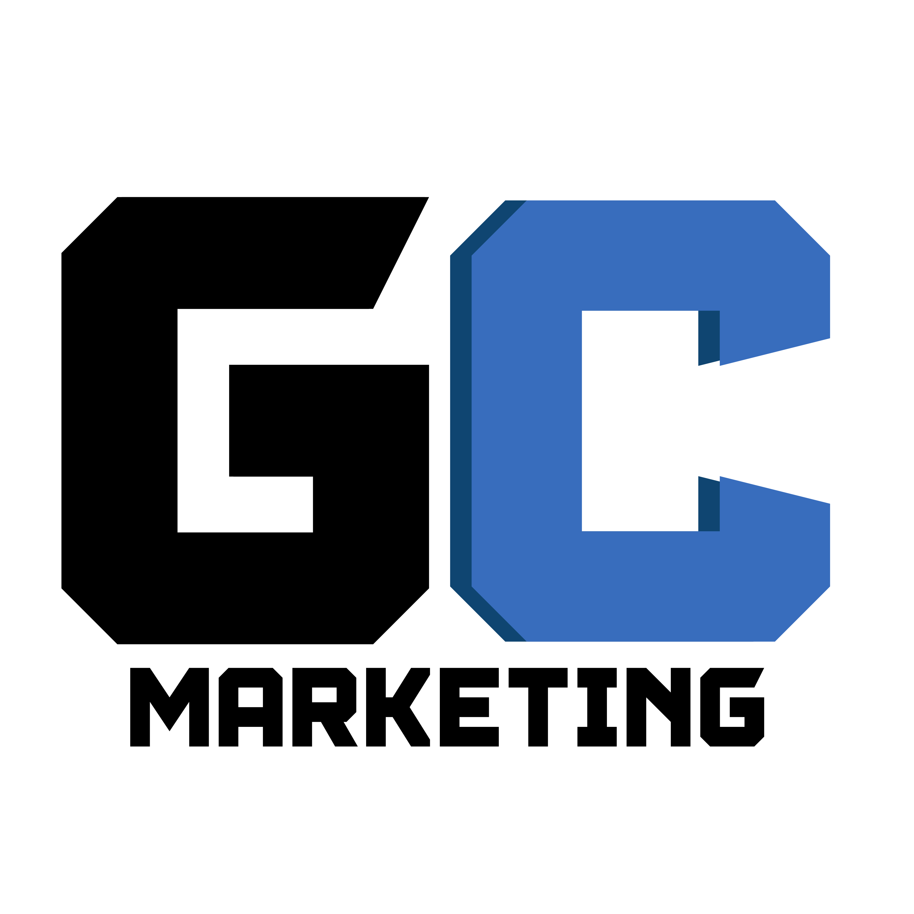

<html lang="pt-br">
<head>
    <meta charset="UTF-8">
    <meta name="viewport" content="width=device-width, initial-scale=1.0">
    <title>Orçamento de Serviços – GC Soluções</title>
    
</head>
<body>
    

        
        <h1>Orçamento de Serviços – GC Soluções</h1>
    

    
    

        <h2>🎨 Desenvolvimento Completo de Identidade Visual</h2>
        
A GC Soluções oferece um serviço completo de Criação de Identidade Visual, garantindo uma marca única, profissional e consistente.

        
        

            <h3>📌 Criação da Logomarca + Identidade Visual (Combo)</h3>
            <ul>
                <li>Desenvolvimento de logotipo exclusivo com 3 opções de design e 2 revisões.</li>
                <li>Briefing detalhado para entender a essência da marca.</li>
                <li>Arquivos finais em formatos variados (PNG, JPG, SVG, PDF).</li>
                <li>Definição de paleta de cores estratégicas.</li>
                <li>Escolha de tipografia e criação de elementos gráficos.</li>
                <li>Manual da Marca para orientação correta.</li>
            </ul>
            <strong>💰 Valor: R$ 700</strong>
        

        <h2>📽 Acompanhamento Audiovisual da Construção da Arena de Beach Tênis</h2>
        
Registre a evolução do seu projeto com vídeos quinzenais, criando um histórico visual profissional da obra.

        
        

            <h3>📅 Duração do Serviço</h3>
            <ul>
                <li>Até 6 meses de acompanhamento.</li>
                <li>12 vídeos entregues ao longo da obra.</li>
            </ul>
        

        <h3>🎥 Planos Disponíveis</h3>
        

            <h3>🚀 Opção 1 – Sem Drone</h3>
            <ul>
                <li>Básico – R$ 70 por vídeo | R$ 840 total</li>
                <li>Intermediário – R$ 100 por vídeo | R$ 1.200 total</li>
                <li>Premium – R$ 120 por vídeo | R$ 1.440 total</li>
            </ul>
        

        
        

            <h3>🚁 Opção 2 – Com Drone</h3>
            <ul>
                <li>Básico – R$ 240 por vídeo | R$ 2.880 total</li>
                <li>Intermediário – R$ 280 por vídeo | R$ 3.360 total</li>
                <li>Premium – R$ 300 por vídeo | R$ 3.600 total</li>
            </ul>
        

    

    

        <h2>📩 Entre em Contato</h2>
        
Fale conosco e personalize essa solução para o seu negócio!

        <a href="mailto:contato@gcsolucoes.com" class="cta" target="_blank">Enviar E-mail</a>
          
        <a href="https://wa.me/5531998600343" class="cta" target="_blank">📲 Fale no WhatsApp</a>
    

</body>
</html>
